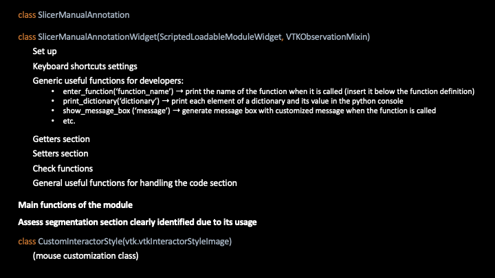
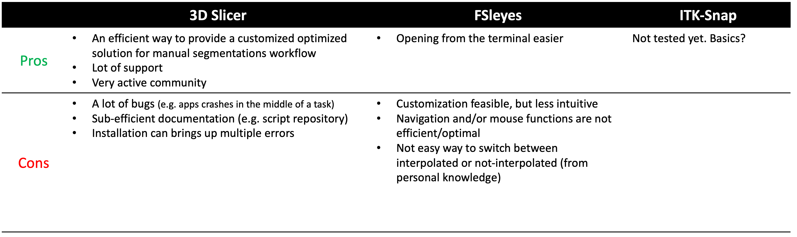

# This file mentions the contributing guidelines for this project.

### For developers

Please feel free to update this programming code of conduct if relevant. We appreciate feedback.

* This project uses the PEP8 convention for naming. Reminder:

  * MyClass for naming a Class;
  * MY_CONSTANT for naming a CONSTANT
  * my_variable for naming a variable
  * define_my_function() for naming a function (always start with an action verb)
  * TODO: for naming To Dos in the code
  * Max 80 columns
  * One space line has been added between each function for clarity
  * Useful comments are strongly encouraged.
  * *Some of the code may not respects this convention, since previous related work did not seem to use any and some unmodified blocks has not been
* Useful links:

  * [PEP8 style guide official documentation](https://peps.python.org/pep-0008/)
  * [Polytechnique Montreal Home-Made Guide for programming style (in French)](https://github.com/INF1007-Gabarits/Guide-codage-python)
* Here is a summary of how main classes and block of code is being organized in the actual python script SlicerManualAnnotation.py

  
* Pros and cons of 3D Slicer (subjective point of view - MB)

  
