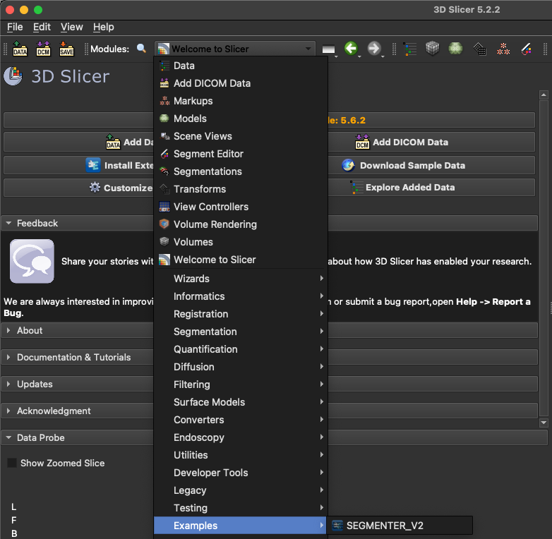
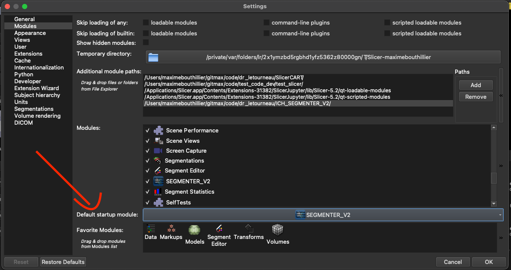

# SLICER-MANUAL-ANNOTATION

* 3D Slicer extension
* Adapted from Dr. Laurent Létourneau-Guillon and team in [https://github.com/laurentletg/ICH_SEGMENTER_V2](https://github.com/laurentletg/ICH_SEGMENTER_V2) and [https://github.com/laurentletg/SlicerCART]() (due to the nature of the adaptations, a new repository has been created).
* Inspired from [Neuropoly](https://neuro.polymtl.ca/) team workflow and [spinal cord toolbox manual correction script](https://github.com/spinalcordtoolbox/manual-correction)
* This work relates to manual segmentation and correction of medical image segmentations
* Although it uses the Brain Imaging Data Structure (BIDS) convention and provide examples from neuroimaging, it is intended for a broaded use in medical imaging

**Keywords:** medical imaging, manual segmentation, manual correction, workflow, ground-truth segmentation, quality control

**Abbreviations:**

- MRI - Magnetic Resonance Imaging
- BIDS - Brain Imaging Data Structure
- GUI - Graphical User Interface
- QC - Quality Control
- SCT - Spinal Cord Toolbox

### Overview

This module aims to facilitate manual segmentation and/or manual correction performed on neurological Magnetic Resonance Imaging (MRI) studies. Objectives are :

1) To optimize workflow of annotators that need to perform manual segmentation tasks and/or manual correction from pre-existing segmentation masks
2) To enable dynamic and iterative consistency self-assessment among manual segmentation tasks

This module has been adapted to perform several tasks. Among other things, it allows the user to:

* Customize configuration preferences (see below for details)
* Customize mouse interaction in the slice viewer
* Customize keyboard shortcuts
* Identify the name, degree and revision step related to the human annotator
* Select folder of interest where volumes are saved (*the folder of interest should be a study site in the BIDS convention)
* Select the output folder where processing and work is preferred to be saved
* Select a ground-truth folder where references studies can be used for iterative self-assessment
* Display in the GUI a case list of all the studies of interests for the segmentation task (*from a site directory or a customized list)
* Select from the GUI case list any volume of interest to display
* Navigate through case list from next and previous buttons
* Load automatically the first remaining case for segmentation in a customized list
* Create automatically all required segments that may be used according to the project configuration each time a volume is displayed
* Toggle interpolation of the volume loaded)
* Start segmentation with automated display of 3D Slicer segment editor module
* Start segmentation with mouse cursor ready to create a segmentation mask of the first label, without any further action required
* Execute multiple automated functions when saving segmentation masks for a given volume. Indeed, the automated functions:
  * Save segmentation masks in the selected output folder/versions (*if first version, creates automatically a versions folder)
  * Track the different versions (save the following version if previous version(s) already exist(s)) **N.B. limitation to 99 versions for a single volume*
  * Save a .csv file with segmentation statistics (e.g. subject, annotator's name and degree, revision step, comments)
  * Save a .json with segmentation statistics (e.g. subject, annotator's name and degree, revision step, comments) **TODO**
  * Generate a QC report (using the QC report template from SCT) **TODO**
  * Go to the next remaining case and make it ready to segment without any further action
* Toggle the latest version segmentation masks (you can easily display the image with or without segmentation mask from a toggle button)
* Toggle a versioning box that enables to show multiple versions at the same time for a given volume
* Customize new segmentation masks from previous version segmentation (instead of starting from scratch)
* Assess the user agreement with reference segmentation masks from different volumes (e.g. considered as appropriate ground-truth and/or subjects with segmentation already completed) by automatically compute Dice Score (other metric(s) )can also be used/generated)
* Update all (or specific) segmentation versions to the derivatives folder according to the reference dataset with BIDS and automatically track versioning by using .git **TODO**
* Integrate new features from what has been built to date

### Requirements

* MacOS Sonoma (recommended)
* A working version of [3D Slicer](https://download.slicer.org).
  * N.B. The version used to develop this module is the version 5.2.2 since more recent versions were not able to support some extensions that previously worked (e.g. JupySlicer)

This module has been developed on:

* MacOS Sonoma version 14.4.1
* 3D Slicer version 5.2.2

Although it may work on other versions and/or operating system, please note that it has not been tested.

### Installation steps

1. Install [3D Slicer](https://download.slicer.org).

   1. You may encounter issues with 3D Slicer installation. When you open 3DSlicer, you should not have any error messages (in red) automatically appearing the the python console. If so, please correct/debug them before proceeding to the next steps.
2. Clone this repository in a location you have access.
3. Modify `label_config.yml` to describe your annotations. There can be as many or as few as you would like. The colors are configurable using RGB integer values between 0 and 255. These can also be modified directly in the extension.
4. Open 3D Slicer.
5. Activate the checkbox `Enable developer mode` in `Edit -> Application Settings -> Developer -> Enable developer mode`.
6. Add the path of this repository in `Edit -> Application Settings -> Modules -> Additional module paths`.

   * There might be errors. These would be seen in the Python Console.
7. The module can be found under `Examples -> Slicer Manual Annotation`.

   
8. (Optional: set the Slice Manual Annotation module to launch at 3DSlicer startup. To do so, go in `Edit -> Application Settings -> Modules -> Default startup module`.)

   

### Troubleshooting

* Qt might need to be installed. The first five steps of the following procedure might be useful for this: [procedure](https://web.stanford.edu/dept/cs_edu/resources/qt/install-mac).
* If some modules are missing (`ModuleNotFoundError`), they must be added to the 3D Slicer environment by using the following commands in the Python Console:

  `from slicer.util import pip_install`. Alternatively, it is possible to use : slicer.util.pip_install('XYZ')
  `pip_install("XYZ")` where `XYZ` is replaced by the proper library

  > Minimally the following packages are not already available (copy and paste in the 3D Slicer python interactor):
  >

  ```py
  slicer.util.pip_install('pandas')
  slicer.util.pip_install('nibabel')
  slicer.util.pip_install('pynrrd')
  slicer.util.pip_install('pyyaml')
  slicer.util.pip_install('slicerio')
  ```

### Usage

This video (12min30) summarizes functions and development context about this module ([link here](https://www.dropbox.com/scl/fi/ddhj5f2rx2ydzy2k7s6b8/slicer-manual-annotation_overview.mov?rlkey=rhgs9usmhqfbfe9tylmk42tlo&st=c5zhnyjs&dl=0)).

This video (40 min) explains in details the workflow proposed by this module and gives example of how it works ([link here](https://www.dropbox.com/scl/fi/j8e3xuhugjylg3hhxhzm7/20240619_slicer-manual-annotation-detailed_explanations.mov?rlkey=0otcuw4nwjuo8l72qxohir8ry&st=6vu8ob2n&dl=0)).

#### Configuration & Settings

A configuration file `config.yaml` is required to use the extension, and customize preferences. In this module, the configuration file allows to:

* Select default working directories
* Specify folder organization (e.g. BIDS)
* Specify volume file extensions (e.g. .nii.gz or .nrrd)
* Specify contrasts of interests (e.g. T2w) *****MRI ONLY! ADAPTATIONS FOR SCAN TODO**
* Select activating or deactivating automated interpolation processing when a volume is loaded and displayed in the slice view
* Select the number of label mask(s) that may be required for a given volume in the segmentation workflow
* Specify the name, label value and desired color for each label mask
* Specify keyboard shortcuts that the user wants to use
* Customize slice viewer options (e.g. "Red" module only to focus the slice viewer on axial slices ) **ENABLE axial and Sagittal loading the appropriate sequences at the same time TODO**

Once the configuration file has been settled, the module can be used for manual segmentation and/or manual correction tasks.

Below are usage examples that guide the user through accomplishing different tasks.

#### At each start

(**Config the option to launch automatically the last folder used TODO)**

1. Select the volume folder you want to use for your segmentation task. Please note that this selection has been settled voluntarily to be done at each startup since the folder should be a site (e.g. site_003) in a BIDS formatted dataset, and that a site may change according to the evolution of a project.
2. Select the ouput folder you want to use for saving your segmentations.1. If empty: this will automatically create two .yaml files 1) allCases.yaml containing all the cases matching criteria of interests (from the config.yaml file) from the selected volume folder directory 2) remainingCases.yaml containing all remaining cases to segment. Please not that this folder does not needs to be empty (see below).
   2. If not empty: this will begin by looking for the 2 files allCases.yaml and remainingCases.yaml and update the GUI case list according to the list 'FILES_SEG' in allCases.yaml, and display in the slice viewer the first volume named in the list 'FILES_SEG' in remainingCases.yaml. In fact, if you want to focus your segmentation task on a specific contrast and/or view (e.g. T2w sagittal), this allows the GUI case list (from allCases.yaml) to represent your cases of interests (you just need to replace the elements of 'FILES_SEG' list in allCases.yaml by the elements of interests [at the first time the task is about to be performed, the 'FILES_SEG' list in remainingCases.yaml would ideally be the same as in allCases.yaml). Also, if you have already started your segmentation task (e.g. segmentation completion for 5 cases), this selection will enable to start from where you were at the end of your last segmentation (will load automatically the first element of remainingCases.yaml).

3. Select the ground-truth references folder you want to use when assessing your consistency and/or agreement with ground-truth images.

#### **Assess Segmentation and Get Results buttons**

To test if your segmentations that you want to perform would be consistents with some already considered successful manual segmentations and/or with segmentations that you have previously done, you may want / should try to perform manual segmentation on a case that has been already completed. This module allows you to do it in 3 steps:

1. *Click on Assess Segmentation button:* this will randomly select a volume in the ground-truth references folder ---> display it in the slice viewer with an anonymized name ---> create new test segments according to the label maks configured for this project ---> open the segment editor module and makes you ready to perform manual segmentation (same as if you would segment a new case)
2. *Perform manual segmentation:* complete a manual segmentation task as if you would proceed to the segmentation of a new case
3. *Click on Get Results button:* once you have completed the manual segmentation and clicked on this button, this will automatically compute the Dice Score (an agreement metrics) between your freshly done segmentation and the reference segmentation for each segmentation mask labels. If both segment are empty, this will show the value infinite, and label(s) will not be considered in the Dice Score mean.

#### **Start Segmentation**

**Write the annotator's name in its specific text box. Select the annotator's degree and revision step (from 0 to 2) in the dropdown label menu. Altough this information can be modified at any time, it is mandatory for saving segmentations.**TODO: activate the function that mandate annotator's name requirements.**  **Please note that the revision step is different than the version since a single user may have multiple segmentation versions for the same revision step and both should not interfere.*

When you are ready to perform manual segmentation and/or correction on new data, you can click on Start Segmentation.

This will open the 3D Slicer segment editor modules and enables you to paint on the volume for the first segmentation label of the config.yaml file.

If you want to perform segmentation for another mask, you need to click on it in the segment editor module.

N.B. #1 You can adjust the painting sphere dimension by pressing "Shift" and scrolling the mouse wheel after having pressed in the slice viewer.

N.B. #2 From the moment you modify the first segmentation label in your segmentation label masks list, a timer is started in the background and will be resetted only when segmentation is saved.

#### **Save segmentation**

**Once a segmentation of a case is ready to be saved, you have to click on the Save segmentation button.**

**As mentioned earlier, this will:**

* **Save segmentation masks in the selected output folder/versions (*if first version, creates automatically a versions folder)**
* **Track the different versions (save the following version if previous version(s) already exist(s)) N.B. limitation to 99 versions for a single file*
* Save a .csv file with segmentation statistics (e.g. subject, annotator's name and degree, revision step, comments)
* Save a .json with segmentation statistics (e.g. subject, annotator's name and degree, revision step, comments) TODO
* Generate a QC report (using the QC report template from SCT) TODO
* Save the segmentation mask in the derivative folder of the subjet, and git version it! TODO (could be also from a QPushButton)
* Go to the next remaining case and make it ready to segment the first segmentation label mask without any further action

#### **Load masks**

This button allows to display/undisplay the latest version segmentation masks for a given volume (toggle).

For example, if the latest version for a given version is _v03 for label1 and label2, but _v02 for label3, _v03 for label1 and label2 and _v02 for label3 will be displayed.

Please note that if you want to see the segmentation mask for the currently displayed volume, you need to click again on the same case in the UI case list. TODO: make it update automatically ...

#### **Toggle Segmentation Versions**

This button allows to display specific versions in the slice viewer. A single or multiple versions can be displayed at the same time according to the user's needs. When a version is selected and displayed, the button becomes with a green background to indicate that the version is currently displayed. If the button is clicked again (toggled), then the corresponding version is undisplayed and the button becomes with normal background color (indicates that the version is not loaded).

N.B. If you open the segment editor and remove from the display some segment for a given version (even all), the toggle buttons will stay with green background. TODO: correct a bug when 2 labels selected (works ok with 3 labels) that makes loading 2 versions at the same time.

#### **Toggle Interpolation**

This button reverses the interpolation state of the volumes that are displayed. By default, the state of each volume (and segmentation mask) will be the one setted in the config.yaml file. If the toggle Interpolation is clicked, interpolation state of each volume that will be loaded after will be the same that has been determined by the last click on the Toggle Interpolation button. This can be reached also from a keyboard shortcut.

****TODOs:****

* ** Address issues related to this module**
* ** Merge configuration for MRI and CT-Scans in the same module/extension**
* ** Merge development with SlicerCART from Dr. Letourneau-Guillon's team**
* ** Integrate the module as an official 3D Slicer plug-ins**
* ** Assess module's utility by integrating it into a methodology validation study on manual segmentation**

Please note that we appreciate any constructive feedback. Feel free to reach us if you have any suggestion and/or comments.

### Other extensions that could be useful

* `SlicerJupyter` to be able to use Jupyter Notebooks connected to 3D Slicer.

### Other resources

* [3D Slicer Tutorials](https://www.youtube.com/watch?v=QTEti9aY0vs&)
* [3D Slicer Documentation](https://www.slicer.org/wiki/Documentation/Nightly/Training)

**
