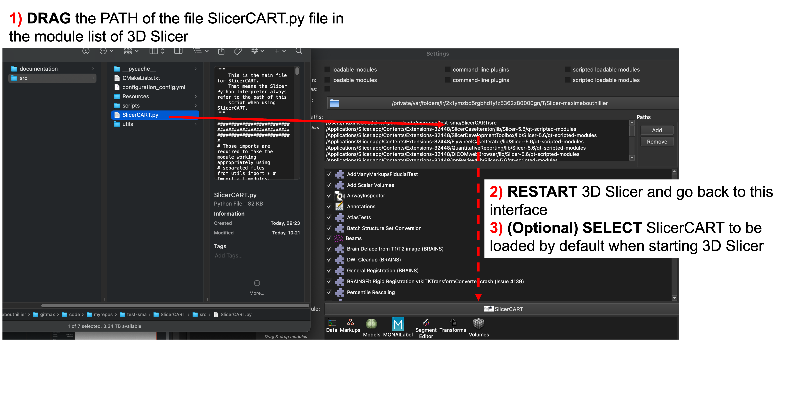

# SlicerCART Installation

### Requirements

* MacOS Sonoma or Sequoia is recommended 
* A working version of [3D Slicer](https://download.slicer.org).
  * N.B. The version currently used to develop this module is the version 5.6.2 (most stable release as of 2024-10-22). The version 5.2.2 has also been used.

This module is currently used on:

* MacOS Sequoia 15.0.1
* 3D Slicer version 5.6.2

Although it may work on other versions and/or operating system, please note that it has not been tested.

## Installation Steps

1. Install [3D Slicer](https://download.slicer.org).
2. Make sure that you are able to open and use the 3D Slicer software before 
   trying installing any extension/module. 
   3. If you encounter some problems, you are encouraged to refer to:
      4. [3D Slicer Documentation](https://slicer.readthedocs.io/en/latest/)
      5. [3D Slicer forum](https://discourse.slicer.org/) (very active community)
3. Clone the [SlicerCART repository](https://github.com/neuropoly/slicer-manual-annotation) in the location of your choice.
4. Open 3D Slicer.
5. Activate the checkbox `Enable developer mode` in `Edit -> Application Settings -> Developer -> Enable developer mode`. 
6. Add the path of the `SlicerCART.py` file in `Edit -> Application Settings 
   -> Modules -> Additional module paths`.(N.B. 1) You must have the file: 
   if it is the folder path, then the module will not work; 2) in the 
   Additional modul path section, the path copied might be shown to the 
   folder: this is a Slicer thing, and should not affect working property of 
   the module if it was the file that you copied).
7. The module can be found under `Examples -> SlicerCART`: the module should now be opened (N.B. 1) If first use, you may have additional requirements to install. A pop-up window from Slicer advertising you should pop-up if so: just click ok).
8. (Optional) Set the SlicerCART module to launch at 3DSlicer startup. To do so, go to `Edit -> Application Settings -> Modules -> Default startup module`
9. There might be errors. These would be seen in the Python Console: if any errors, we highly recommend you to fix them before any further use!

**IN SUMMARY:**

Install 3D Slicer --- Enable Developer Mode --- Add the PATH of SlicerCART.
py file in the modules list --- (Optional) Select to launch SlicerCART at 3D 
Slicer --- restart 3D Slicer --- READY FOR USE!

### Troubleshooting 

* Qt might need to be installed. The first five steps of the following procedure might be useful for this: [procedure](https://web.stanford.edu/dept/cs_edu/resources/qt/install-mac).

### Other extensions that could be useful
* `SlicerJupyter` to be able to use Jupyter Notebooks connected to 3D Slicer.

[GO BACK on Documentation Welcome Page](welcome.md). 
[CONTINUE to QuickStart](quickstart.md).
