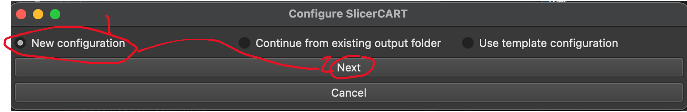
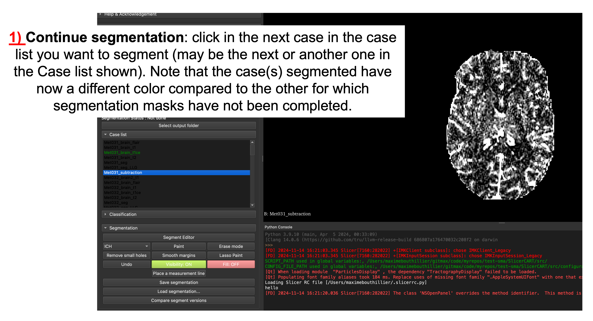

# SlicerCART QuickStart

Follow the steps below to use SlicerCART.

### Before starting

You should have:
* Successfully installed 3D Slicer
* Sucessfully installed SlicerCART

Please review [Installation Steps](installation.md#installation-steps) if those criteria are not 
fullfilled.

### Getting started

Example use case: viewing different volumes in a given dataset

###### 1. Open 3D Slicer
###### 2. Launch SlicerCART
###### 3. Select "New Configuration", and click on Next
When the module is loaded, a pop-up window appears and allow the user to 
customize SlicerCART settings. 

###### 4. Specify the appropriate dataset options and tasks, and then click Apply
For example, select if you will complete segmentation and/or classification 
tasks, the modality (takes only 1 for now), if you impose BIDS (will pass a 
BIDS validator test before loading volumes), dataset volumes extensions (i.e.
Input File Extension), etc.

By default, some segmentation labels will be used. We recommend for now to 
use those (soon, it should be able to modify them by clicking on Configure 
Segmentation). The same applies for "Configure Classification".

###### 5. Select Volumes folder, and specify annotator information 
* Select the folder that contains the images that you want to process (if 
* BIDS folder, will not consider images in  derivatives), manipulate, view, etc.

* Specify the Annotator name, degree and revision step (all are mandatory 
*    for saving functions).

N.B. If loading cases in the UI fails, please open an issue on the Github 
   repository or ask a team member. If this steps has not succeed, you will 
   not be able to use SlicerCART (e.g. imaging format incompatibility).

###### 6. Select Output folder
Select the folder where output data (e.g. segmentation masks, statistics) 
will be saved. For now, it must be empty.

###### 7. Display Volume to Segment
Click on the case in Case list you want display and/or perform segmentation, 
so it will be shown in the Slicer Viewer.

###### 8. Start Segmentation
Click on the case you want to 
Start segmentation by clicking on:
- SegmentEditor: will open the default segment editor of 3D Slicer
- Paint: will make the user able to paint the **first** mask label
- Erase: will make the user able to erase current segment label

###### 9. Save Segmentation
Once segmentation is completed, click on Save segmentation to save the 
segmentation mask in the output folder. Note that a .csv file will be 
generated for basic segmentation statistics (e.g. time of segmentation, 
annotator information, etc.).

###### 10. Continue Segmentation
Click in the Case list on the next case you want to segment.

### Further Improvements
Functionalities soon to be implemented:
* Load from non-empty volume folder, enabling to load automatically the next 
remaining case in a list of segmentation cases to be done
* Load automatically the paint feature for the first label when starting segmentation
* Go automatically to the next remaining case when saving segmentation

For any feedback, please add your comments on: https://docs.google.com/document/d/1RRDnYuUtevRtKzdGpOBCORbUAweMCMtD0bUfg_Qt2qE/edit?usp=sharing

If you have any question and/or inquiry, please feel free to open a new 
issue on the [SlicerCART Github repository](https://github.
com/neuropoly/slicer-manual-annotation/issues)

Thank you!

The SlicerCART Team

[GO BACK on Documentation Welcome Page](welcome.md).
[GO BACK on Installation Page](installation.md). 
[CONTINUE to Video Tutorials](videotutorials.md).