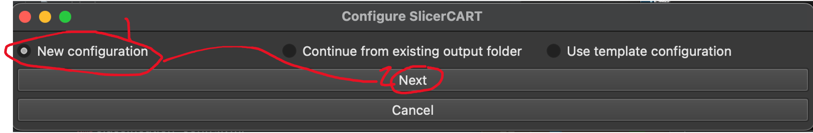
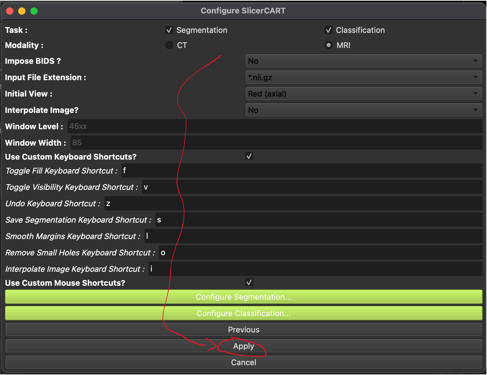
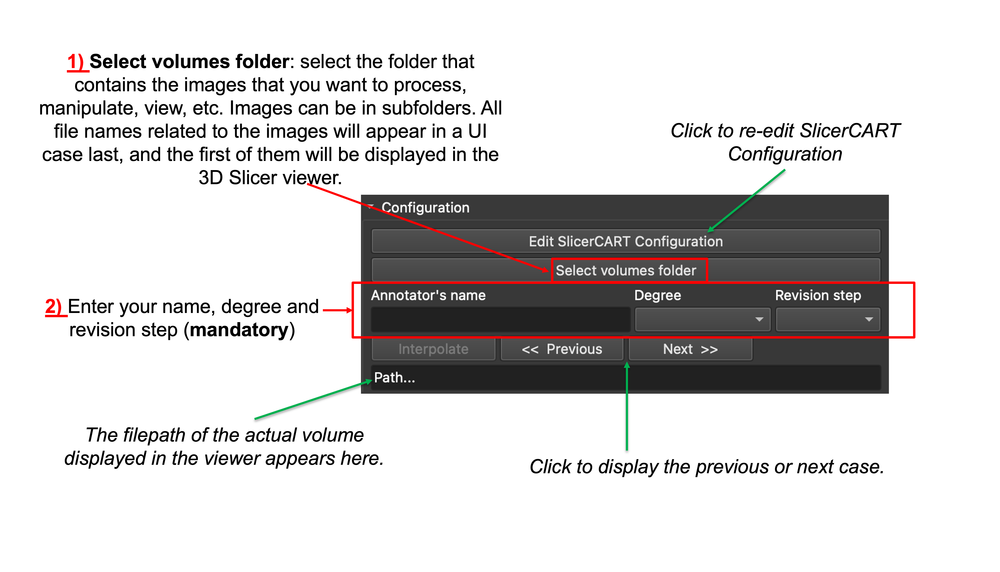
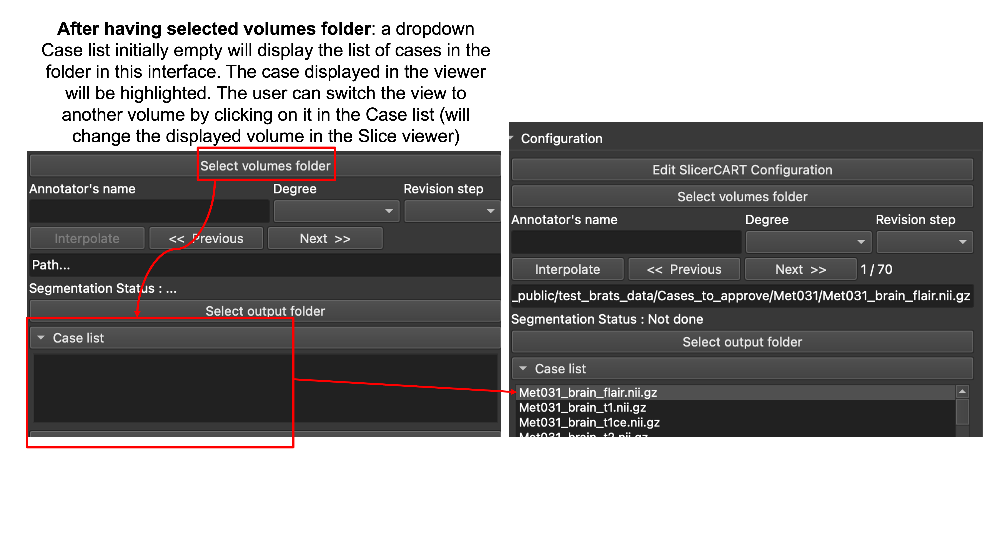
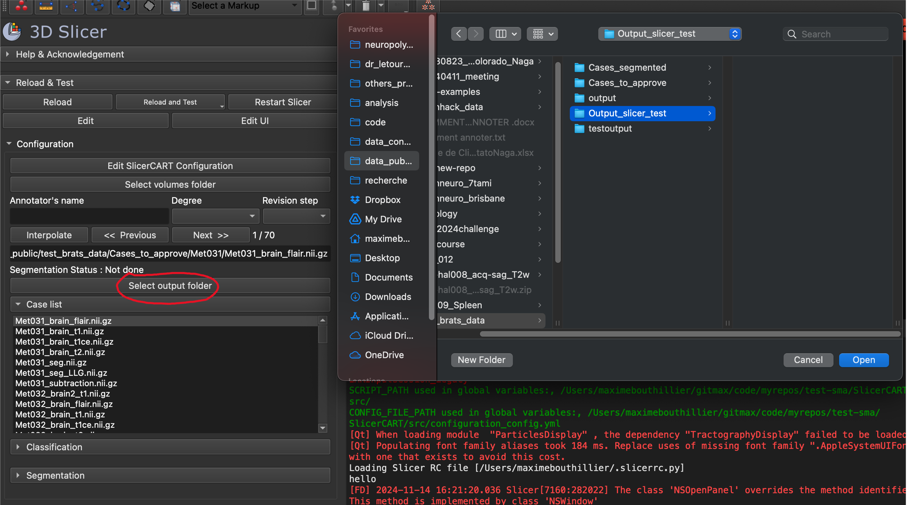
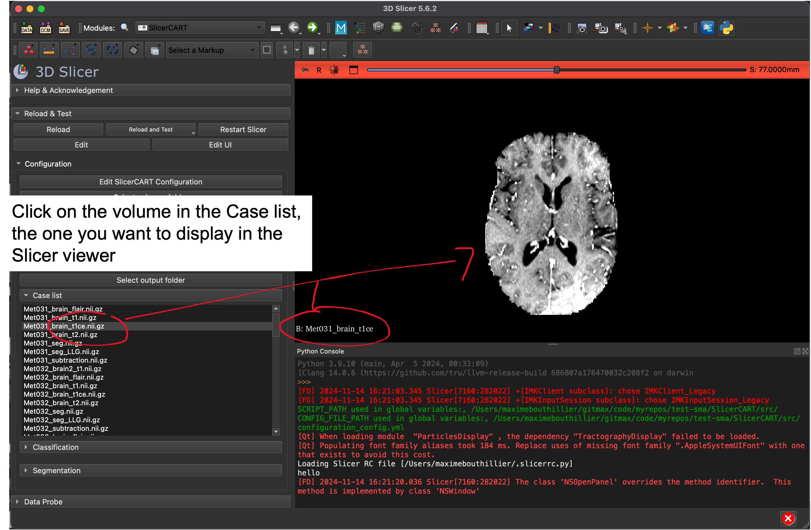
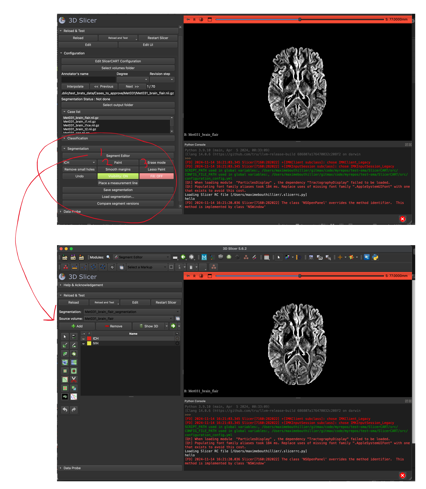
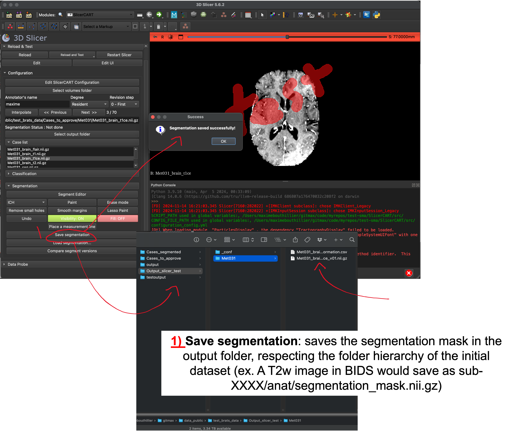
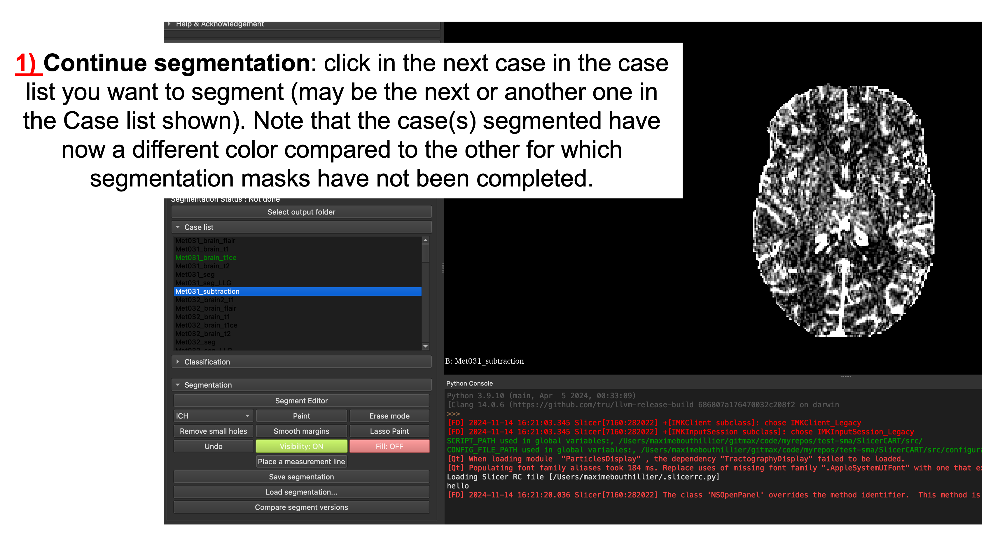

# SlicerCART User Guide

Detailed information for using SlicerCART in 3D Slicer is provided below.

### Startup

When the module is loaded, a pop-up window appears and allow the user to preset the module according to the intended use case.

###### New configuration

To select when the module is used for a new task.

###### Continue from existing output folder

To select when the module is used for continuing a previously started task.

###### Use template configuration

To select when the user wants to load its own configuration template in the SlicerCART. WIP

### New configuration

A pop-up windows allow to specify parameters and customize settings.

* **Task:** select if the module is used for segmentation, classification or both.
* **Modality:** select if volumes are CT-Scans or MRI
* **Impose BIDS?:**  related to folder organization and files naming convention. Select yes if you want to load volumes only if the folder organization respects the Brain Imaging Data Structure (BIDS) format (once a volume folder will be selected, a BIDS validator will be run and a pop-up window will show if the selected folders do not respect BIDS: in the case, the volumes will not be able to load if BIDS is imposed).
* **Input File Extension:** specify the files’extension. Currently, nifti and nrrd format are accepted only (supported by Slicer). Note that if a dataset (i.e. volume folder) contains both nifti and nrrd volumes, the module will not be able to work (you can choose either one or another but not both).
* **Initial View:** select the plan (axial, sagittal, or coronal) that the 3D Slicer viewer will display. Soon, implementation of viewing the same volume in different planes (e.g. different plan) will be done.
N.B. In 3D Slicer, each viewer plane has an associated color: Red – Axial;
Yellow – Sagittal;
Green – Coronal

* **Interpolate Image?:** select if loaded volumes from raw MRI data have 
  automated postprocessing treatment to make the image smoother. Note that 
  this is usually automatically done in Slicer: however, for example, 
  deep-learning based model used for segmentation are trained on raw MRI 
  data which may create unprecise ground-truth segmentation masks or 
  compatibility issues. Note also that although if images are interpolated, 
  segmentation masks are bu default saved without any smoothering filter 
  (compatible for deep learning model training)
* **If Modality == CT:**
The Window Level and Window With default level can be selected, enabling to display a specific default contrast for each volume. Accepts only integers
Note that if you have selected CT, but do not want to specify the contrast information, the default volumes will be loaded using a Window Width/Level of 45:85
* **Use Custom Keyboard Shortcuts?:**
Select to show a dropdown menu enabling customization of keyboard shortcuts 
  for predefined basic functions. Name of the proposed shortcut corresponds 
  to its action.
* **Use Custom Mouse Shortcuts?:**
Select to show a dropdown menu enabling customization of mouse button functions for image navigation and manipulation in the 3D Slicer viewer.

###### Configure segmentation

Allows the user to specify the default labels name, value and display colors for each segmentation mask in the dataset. For example, if the tasks is to do segmentation of brain hemorrhage, intraventricular hemorrhage and peri-hematoma edema, the user can specify the label names (e.g. ICH --- for intracranial hemorrhage; IVH --- for intraventricular hemorrhage; PHE --- perihematomal edema)
The user can change the number of labels by clicking remove or add. 
Click apply to save the segmentation configuration.

###### Configure Classification

Allows the user to specify the labels and their value related to 
classification types, and their selection mode. Click on Apply to save the configuration settings.

The user is now ready to start doing segmentation, classification or both tasks!

### Start Segmentation and/or Classification

###### Select Volumes folder, and specify annotator information 
* Select the folder that contains the images that you want to process (if 
* BIDS folder, will not consider images in  derivatives), manipulate, view, etc.

* Specify the Annotator name, degree and revision step (all are mandatory 
*    for saving functions).

N.B. If loading cases in the UI fails, please open an issue on the Github 
   repository or ask a team member. If this steps has not succeed, you will 
   not be able to use SlicerCART (e.g. imaging format incompatibility).

###### Select Output folder
Select the folder where output data (e.g. segmentation masks, statistics) 
will be saved. For now, it must be empty.

###### Display Volume to Segment
Click on the case in Case list you want display and/or perform segmentation, 
so it will be shown in the Slicer Viewer.

###### Start Segmentation
Click on the case you want to 
Start segmentation by clicking on:
- SegmentEditor: will open the default segment editor of 3D Slicer
- Paint: will make the user able to paint the **first** mask label
- Erase: will make the user able to erase current segment label

###### Save Segmentation
Once segmentation is completed, click on Save segmentation to save the 
segmentation mask in the output folder. Note that a .csv file will be 
generated for basic segmentation statistics (e.g. time of segmentation, 
annotator information, etc.).

###### Continue Segmentation
Click in the Case list on the next case you want to segment.

TODO Next step for User Guide Documentation:
* Continue form existing output folder: If Continue from existing output 
  folder was selected, a pop-up window takes the user to select the output folder of the results where

* Classification Documentation
* Assessment Documentation

[GO BACK on Documentation Welcome Page](welcome.md).
[GO BACK to Video Tutorials](videotutorials.md). 
[CONTINUE to List of Functionalities](functionalities.md).

